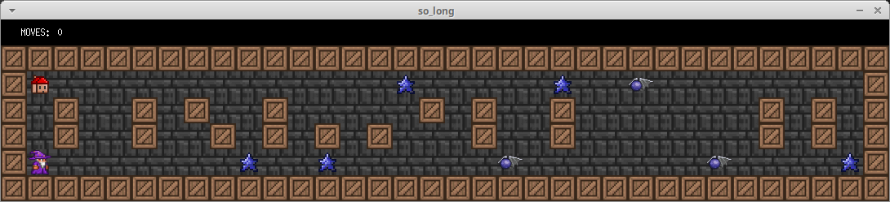

# so_long
O so_long é um pequeno jogo 2D utilizando a biblioteca gráfica MinilibX.

### Como compilar?

Antes, é necessário instalar algumas dependências.
```
sudo apt install libbsd-dev libxext-dev
```

Utilizando o Makefile você pode criar o arquivo executável *so_long* ou *so_long_bonus*
```
make
```
ou
```
make bonus
```

### Mapa
Para executar o programa, é necessário escolher algum dos mapas. Exemplo:
```
./so_long assets/maps/big.ber
```
ou
```
./so_long_bonus assets/maps_bonus/big.ber
```
O mapa precisa estar no formato *.ber* e ser composto pelos caracteres abaixo:
| Caractere | Descrição                                      |
| --------- | -----------------------------------------------|
| 0         | espaço livre |
| 1         | parede |
| P         | posição inicial do jogador |
| E         | saída |
| C         | coletável |
| K (bônus) | inimigo |

Abaixo uma imagem de um dos mapas:


### Gameplay
Basicamente, o jogador precisa coletar todas as estrelas pelo mapa, evitando os inimigos (bônus) e saindo ao final.
A quantidade de movimentos é mostrada no terminal (ou na própria tela do jogo, no caso do bônus).

Você pode ver o jogo sendo executado aqui: https://www.youtube.com/watch?v=IcEGdGYS2Tk

As imagens utilizadas são do jogo Terraria.


#### Mais informações sobre a Escola 42 (inglês): https://en.wikipedia.org/wiki/42_(school)
